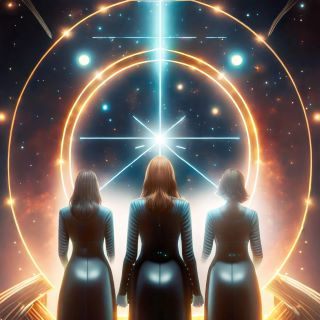

The Conclave of the Celestial Covenant is a secret society that has been in existence for thousands of years, with its roots tracing back to ancient civilizations. The group's founders were a group of powerful mystics and astronomers who believed that the stars and planets held the key to unlocking humanity's true potential. They saw that the movements of the celestial bodies were not just random patterns, but rather a code that could be deciphered to reveal the secrets of the universe. Over time, the Conclave grew in power and influence, attracting individuals from all walks of life who were seeking answers to life's biggest questions. They became known for their advanced knowledge of astronomy, mathematics, and the occult, and were sought out by kings, queens, and other leaders for their guidance and advice. 

Despite their influence, the Conclave remained shrouded in secrecy, with their inner workings and beliefs known only to a select few. They were rumored to possess ancient texts and artifacts that held the secrets of the universe, and were said to have developed a system of magic that allowed them to harness the power of the stars. As the centuries passed, the Conclave continued to grow and evolve, always staying one step ahead of those who sought to uncover their secrets. They became known for their ability to predict celestial events, and were often called upon to advise on matters of state and global importance. But the Conclave's true purpose went far beyond simply advising leaders or predicting celestial events. They had discovered the existence of the Great Old Ones, ancient beings of immense power and malevolence that lurked beyond the stars. These beings were the stuff of nightmares, and their influence could be felt in the darkest corners of the human psyche. The Conclave knew that the Great Old Ones posed a threat not just to humanity, but to all life in the universe. They had seen the destruction that these beings could wrought, and knew that they must be stopped at all costs. 

And so, the Conclave dedicated themselves to protecting the human race against those who would summon any of the Great Old Ones. They worked tirelessly to uncover and disrupt the plans of those who sought to bring about the return of the Great Old Ones. They infiltrated secret societies and cults, using their knowledge of the occult to counter their dark rituals and prevent them from unleashing the horrors that lurked beyond the veil. Today, the Conclave of the Celestial Covenant remains a mysterious and enigmatic organization, with their influence and power felt throughout the world. Few know the truth about their inner workings, but one thing is certain: they will continue to protect humanity against the forces of darkness that lurk beyond the stars, and will stop at nothing to prevent the return of the Great Old Ones.

The Conclave has once again been called upon to protect humanity. 

Upon receiving a tip someone had been researching Azathoth at a library in the path of the upcoming annular eclipse, the Conclave dispatched agents to investigate the library in the message. The timing could not be a coincidence. [Find the library](https://instagram.com/spacecoastsec)
