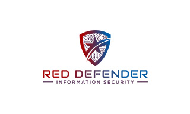
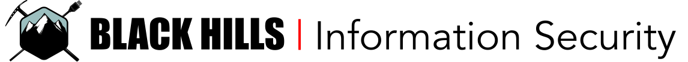
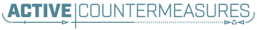
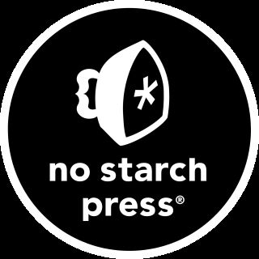
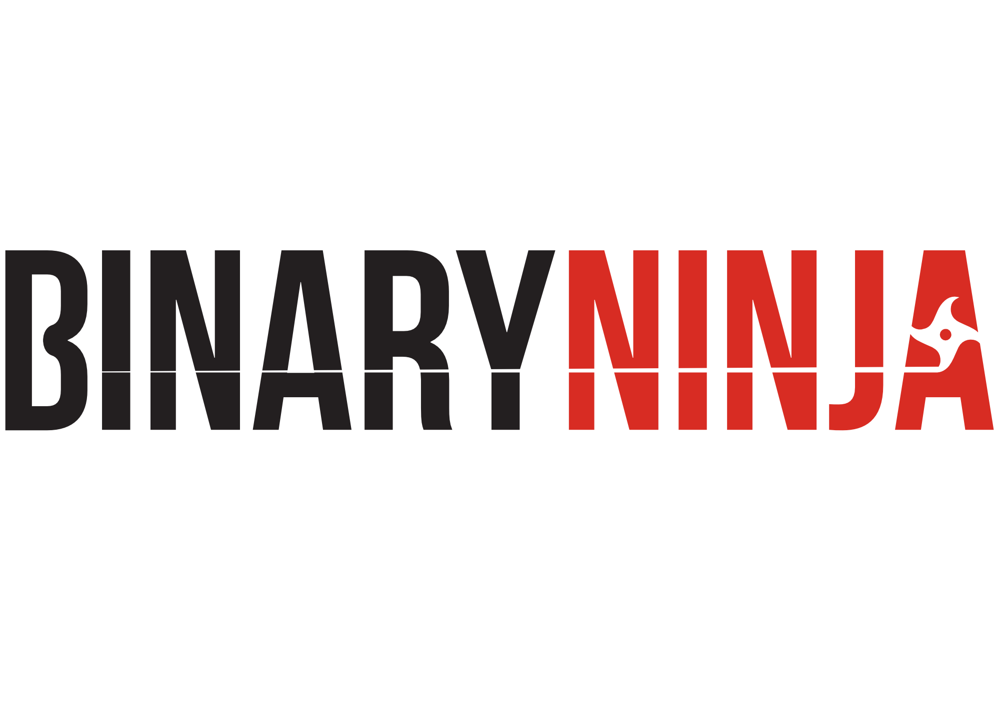

<h2 style="text-align: center;">Hackation 2024 | Sponsors</h2>

  <a href="registration">Registration</a> |
  <a href="sponsors">Sponsors</a> |
  <a href="speakers">Speakers</a> |
  <a href="schedule">Schedule</a> |
  <a href="villages">Villages</a> |
  <a href="call-for-presentations">Call for Presentations</a> |
  <a href="call-for-volunteers">Call for Volunteers</a> |
  <a href="https://forms.gle/BJsMjZXm45aiE7qm8">Contact Us</a>

Our Call for Sponsors is currently open. Below are the categories we are still looking for sponsors to fill. If interested in sponsoring any of the below items, please fill out the following [Google Form](https://forms.gle/EFr5Tz6N1TefYtQt9) 
We are grateful to our sponsors for their support!

## Badge Sponsor

## Lanyard Sponsor

## Swag

[(https://www.guidepointsecurity.com/)]
## Discount Code Sponsors

## License Sponsors

## Training and Certifications Sponsors

## Food Sponsor

## Drinks Sponsor

## Tables and Chairs Sponsor

## Intranet Sponsor

## A/V Sponsor

## Other
