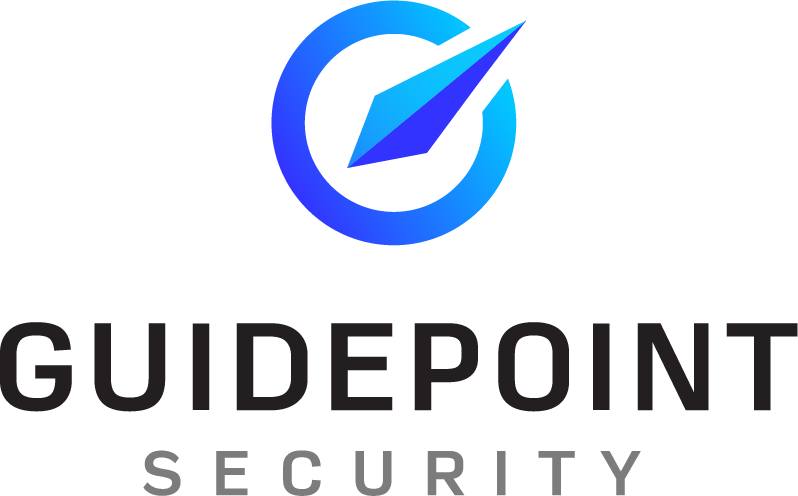
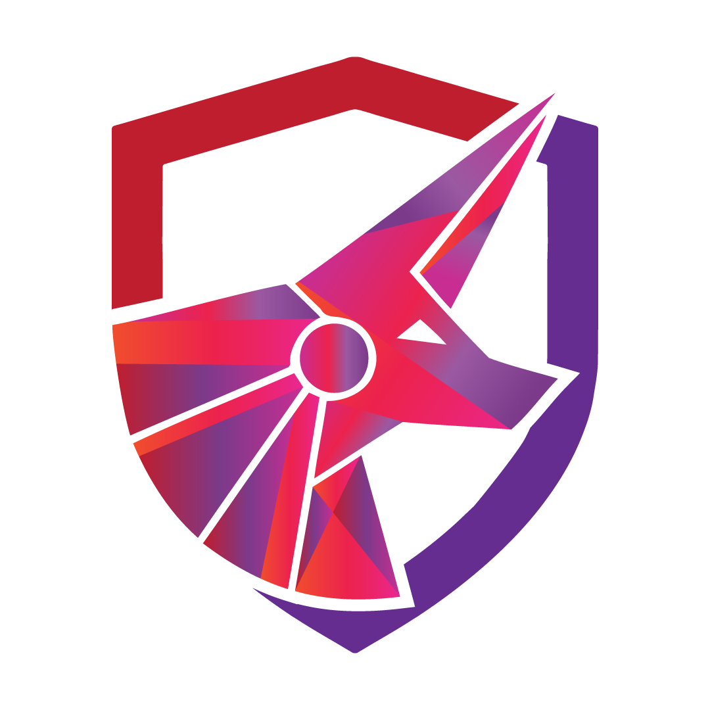

<h2 style="text-align: center;">Hackation 2024 | Sponsors</h2>

  <a href="registration">Registration</a> |
  <a href="sponsors">Sponsors</a> |
  <a href="speakers">Speakers</a> |
  <a href="schedule">Schedule</a> |
  <a href="villages">Villages</a> |
  <a href="ctf">Capture the Flag</a> |
  <a href="https://forms.gle/BJsMjZXm45aiE7qm8">Contact Us</a>

Our Call for Sponsors is now closed. Thank you everyone who submitted to be a sponsor. 

We are grateful to our sponsors for their support!

## Badge Sponsor

## Lanyard Sponsor

## Swag
  
  
 

## Discount Code Sponsors

 

## License Sponsors

 

## Training and Certifications Sponsors

 

## Food Sponsor

## Drinks Sponsor

## Tables and Chairs Sponsor

## Intranet Sponsor

## A/V Sponsor

## Other
